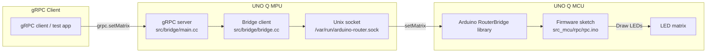
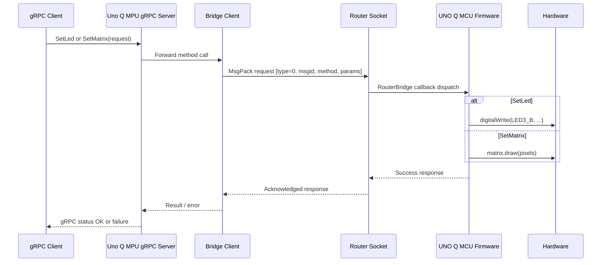

# Hybrid RPC architecture

This document illustrates the current hybrid RPC application: a Linux-side gRPC service forwards requests to an Arduino-compatible MCU over a local bridge socket, and the MCU firmware actuates hardware such as LEDs and the LED matrix.

## Deployment diagram

## Data flow

## Notes

- The Linux side uses gRPC for service RPCs and protobuf messages.
- The bridge layer serializes requests with MessagePack over a Unix domain socket.
- The Arduino sketch exposes callbacks such as set_led_state and set_matrix through the RouterBridge interface.
